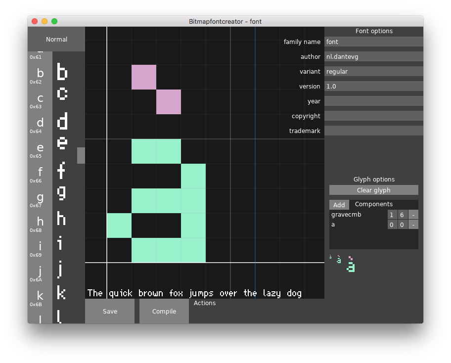

# Bitmap font creator

Love2d application for creating pixel fonts.

## Installation
1. Install [fontmake]
2. Download the file for your OS from the [releases tab]
   - Windows: Extract it and run the `.exe`.
   - MacOS: Extract it and run the `.app`.
   - Linux: Install the [Love2D package], run it with `love bitmapfontcreator_linux.love`

## Usage manual
On startup, Bitmapfontcreator will create a new font.

#### Font options
You can change the font metadata on the top right, under '*Font options*'.
Don't forget to press enter to confirm, though,
since otherwise it won't save the changes.

#### Glyph options
At the bottom right, under '*Glyph options*', three previews are present,
with scaling x1, x2 and x4. To add a subcomponent, click the '*add*'-button,
and click on the glyph you want to add. You can then change the x and y-offset,
or remove it.

#### Character picker
At the left side is the character picker,
above that is the button to switch between the two sets of characters:
- Normal, printable characters
- Combining (non-printable) characters, like only the acute or grave symbol.

#### Drawing canvas
Mouse actions in the drawing canvas:

Button                          | Action
--------------------------------|-----------
left click                      | add pixel
right click                     | remove pixel
middle click *or* ctrl+click | move canvas
scroll                          | zoom

#### Font actions
Bitmapfontcreator will save the font in `ufo`-format, in the save directory.
- If there is no folder with the font name present, it will create one.
- If there is alreaady a folder with the font name present,
it will use that as its font root,
essentially updating the font that was present previously.

For compiling, Bitmapfontcreator will need [fontmake],
which will generate a TrueType-font in the save directory.

Save directory:

Platfom | Path
--------|------
Windows | `%appdata%\bitmapfontcreator\`
MacOS   | `~/Library/Application Support/bitmapfontcreator/`
Linux   | `~/.local/share/bitmapfontcreator/`

To load a font, navigate to the save directory and drag the `.ufo` directory
onto the Bitmapfontcreator window.  
If it doesn't create a font file, there probably was an error while compiling.
To see logs and error messages on windows, run the exe from the command line
as `bitmapfontcreator.exe --console`.
For MacOS and Linux, running Bitmapfontcreator from the command line
should be enough.

## License
See [LICENSE](LICENSE).

This project uses the following libraries:
- [Gspöt](https://notabug.org/pgimeno/Gspot) (Zlib/libpng)

[fontmake]: https://github.com/googlefonts/fontmake#installation
[releases tab]: https://github.com/Dantevg/bitmapfontcreator/releases
[Love2D package]: https://www.love2d.org/
